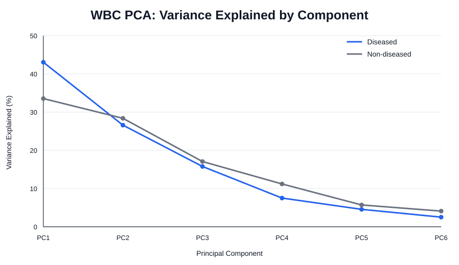
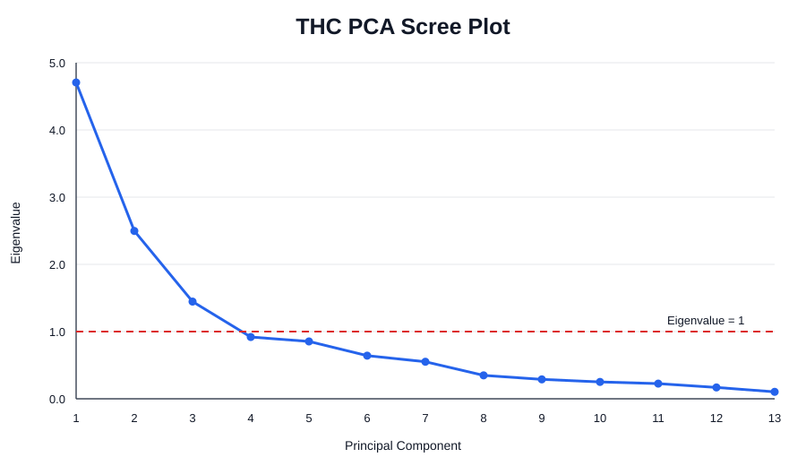
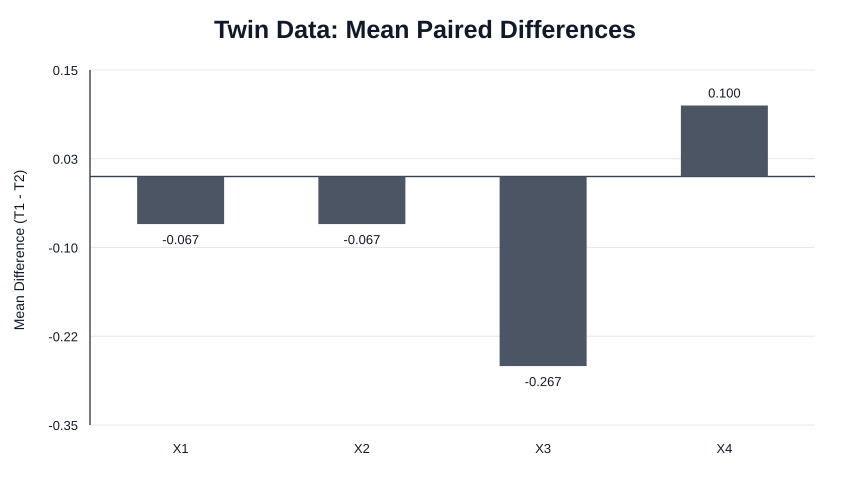

# SAS Multivariate Data Analysis

An end-to-end statistical analysis project in SAS using multivariate hypothesis testing and principal component analysis (PCA) across biological, paired-measurement, and chemical datasets.

The project demonstrates how SAS can be used to validate data, assess statistical assumptions, compare multivariate groups, analyse paired observations, reduce dimensionality, and communicate statistically meaningful findings.

## Why This Project Matters

The analysis addresses four practical analytical questions:

1. Do diseased and non-diseased white blood cell groups differ across their combined morphological characteristics?
2. Can WBC measurements be reduced to a smaller number of principal components?
3. Do paired twin measurements show a significant multivariate difference?
4. Can 13 THC chemical variables be represented by a smaller set of components while retaining most of the information?

## Skills Demonstrated

- SAS programming
- PROC IML
- PROC PRINCOMP
- PROC DISCRIM
- PROC UNIVARIATE
- PROC TTEST
- PROC CORR
- PROC MEANS
- Matrix operations
- Hotelling's T-square testing
- Principal component analysis
- Dimensionality reduction
- Covariance and correlation analysis
- Statistical assumption checking
- Mahalanobis-distance outlier screening
- Data validation
- Reproducible analytical workflows
- Statistical interpretation and communication

## Project Workflow

```text
Raw CSV data
    ↓
File and schema validation
    ↓
Missing-value / duplicate / range checks
    ↓
Assumption diagnostics
    ↓
Exploratory summaries and correlation analysis
    ↓
Multivariate hypothesis testing
    ↓
PCA and dimensionality reduction
    ↓
Interpretation, verification and visual reporting
```

## Repository Structure

```text
programs/
    00_run_all.sas
    00_data_validation.sas
    00_assumption_diagnostics.sas
    01_wbc_hotelling_and_pca.sas
    02_twin_hotelling.sas
    03_thc_pca.sas

data/
    README.md

results/
    assignment-results-summary.md
    assumption-diagnostics.md
    verification.md

outputs/
    figures/
        wbc_pca_variance.svg
        thc_pca_scree.svg
        twin_mean_differences.svg

docs/
    multivariate-analysis-assignment-2.docx
```

### Main programs

- `programs/00_run_all.sas` — master program that runs validation and assumption diagnostics before the main statistical analysis.
- `programs/00_data_validation.sas` — checks required files and variables, status labels, missing values, ranges, row counts, and duplicate rows.
- `programs/00_assumption_diagnostics.sas` — screens normality, covariance homogeneity, and potential multivariate outliers.
- `programs/01_wbc_hotelling_and_pca.sas` — two-sample Hotelling's T-square, univariate tests, and PCA for WBC groups.
- `programs/02_twin_hotelling.sas` — paired Hotelling's T-square analysis.
- `programs/03_thc_pca.sas` — descriptive analysis, correlations, scatterplot matrix, and PCA for 13 chemical variables.

## Reproducibility Improvements

The current code is designed so statistical quantities are derived from the imported data rather than manually copied from previous output.

In particular:

- PCA eigenvalues are captured directly from `PROC PRINCOMP` using `OUTSTAT=`.
- Sample sizes are calculated from the imported datasets.
- Confidence-interval calculations use generated PCA eigenvalues.
- Validation runs before downstream statistical analysis.
- Assumption diagnostics are separated from the main inferential code.
- Potential outliers are flagged for review rather than silently deleted.
- The master runner executes the project in a defined order.
- Recovered datasets were independently checked against the historical results.

This reduces the risk of stale results and makes analytical limitations visible.

## Key Findings

The recovered data reproduce the original numerical results:

- WBC Hotelling's T-square p = **0.463**, providing no evidence of an overall multivariate difference between diseased and non-diseased groups.
- The first three WBC components explain approximately **85.4%** of variance in the diseased group and **79.0%** in the non-diseased group.
- Twin paired Hotelling's T-square p = **0.117**, so the original analysis does not reject a zero multivariate mean-difference vector.
- The first three THC principal components explain approximately **66.5%** of total variation.

See `results/verification.md` for the numerical verification record.

## Visual Results

### WBC PCA

The diseased WBC group concentrates more variance in its first principal component than the non-diseased group.



### THC PCA

The scree plot shows three components above the eigenvalue-1 reference line, consistent with retaining the first three components under the Kaiser criterion.



### Twin paired differences

The four average paired differences are relatively small in magnitude, consistent with the non-significant overall Hotelling result.



## Statistical Assumptions and Limitations

Assumption checks are treated as part of the analysis rather than an afterthought.

For the WBC comparison:

- covariance homogeneity was not rejected in an independent Box's M-style check (p ≈ 0.265);
- some individual variables showed evidence of non-normality;
- a small number of observations were flagged by Mahalanobis-distance screening for review.

For the Twin paired analysis:

- all four difference variables showed clear univariate departures from normality;
- three observations were flagged by Mahalanobis-distance screening;
- the original paired Hotelling result is therefore retained with an explicit normality limitation.

No flagged observation is automatically removed. Exclusion would require a substantive data-quality justification.

See `results/assumption-diagnostics.md` for details.

## Analytical Methods

### WBC group comparison

The WBC analysis compares six morphological variables between diseased and non-diseased observations using:

- group descriptive statistics
- covariance and correlation matrices
- two-sample Hotelling's T-square
- individual two-sample t-tests
- covariance-homogeneity diagnostics
- normality and outlier screening
- PCA for each group

### WBC PCA

PCA is used to investigate whether the six WBC measurements can be represented using fewer dimensions.

The SAS workflow captures eigenvalues directly from `PROC PRINCOMP` and uses them for follow-on component tests and confidence intervals.

### Twin paired analysis

Paired differences are calculated across four measurements and analysed jointly using Hotelling's T-square. The portfolio version also documents the strong non-normality seen in those paired differences.

### THC chemical PCA

The THC analysis examines 13 chemical variables using descriptive statistics, correlations, a scatterplot matrix, and PCA.

`PROC PRINCOMP` uses the correlation matrix by default, which standardizes the contribution of variables measured on different numerical scales before component extraction.

## Data Availability

The programs expect:

- `data/Dataset WBC.csv`
- `data/Dataset TWIN.csv`
- `data/Dataset THC.csv`

The original datasets have been recovered and independently checked against the published statistical results.

The raw datasets are not committed to this public repository until their redistribution rights are confirmed. This avoids assuming permission to republish coursework source data while still documenting the verification transparently.

## How To Run

1. Clone the repository.
2. Place the three required CSV files in the `data/` folder.
3. Open SAS Studio, SAS OnDemand for Academics, or another SAS environment with SAS/IML available.
4. Update `project_root` in `programs/00_run_all.sas`.
5. Run `programs/00_run_all.sas`.

The workflow checks inputs first, then runs assumption diagnostics before the main statistical analysis.

## Current Improvement Roadmap

- Confirm whether the source datasets can be redistributed publicly.
- Run the complete refactored workflow directly in SAS against the recovered datasets and archive selected SAS-native outputs.
- Expand interpretation of PCA loadings so the retained components have clearer substantive meaning.
- Add a concise methodology document for technical reviewers.

## Project Background

This project originated from university coursework in multivariate statistics and has since been reorganised as a reproducible SAS analytics portfolio project.

The original submission is retained in `docs/` for transparency, while the portfolio code is being improved independently for reproducibility, validation, statistical rigor, and recruiter readability.
